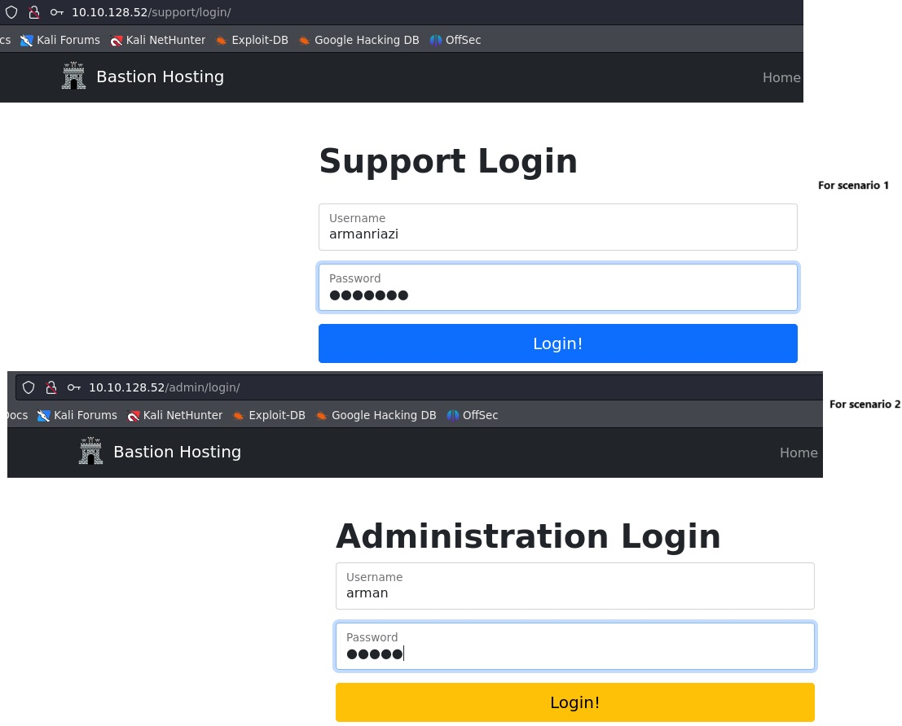
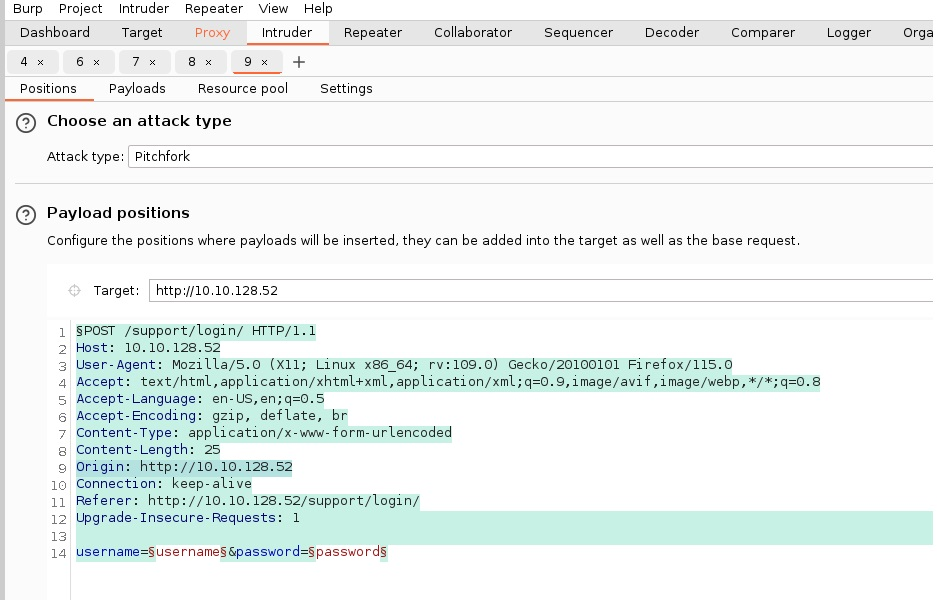
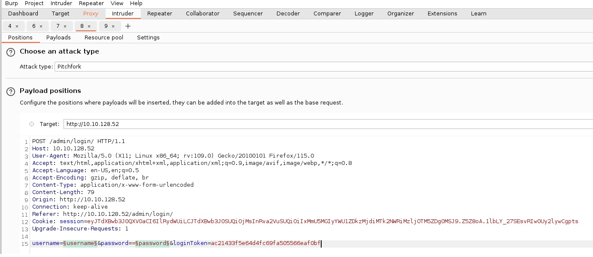
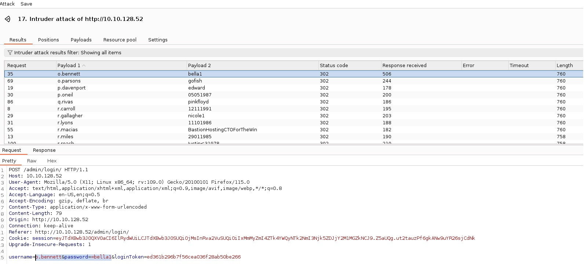

# One of:TryHackMe:Scenario:BurpSuite:BroteForce:UnathorizedAccess

`Consider It as an Ethical Hacking!`

## STAR

| **STAR Component** | **Details**                                                                                                                                                                                                                                                                                                                                                                                                                                                                                                                                                                                                                                                                                  |
| ------------------ | -------------------------------------------------------------------------------------------------------------------------------------------------------------------------------------------------------------------------------------------------------------------------------------------------------------------------------------------------------------------------------------------------------------------------------------------------------------------------------------------------------------------------------------------------------------------------------------------------------------------------------------------------------------------------------------------- |
| **Situation**      | You were tasked with accessing a restricted admin login panel at `http://ip/admin/login`.                                                                                                                                                                                                                                                                                                                                                                                                                                                                                                                                                                                                    |
| **Task**           | Enumerate and brute force valid usernames and passwords to gain access using Burp Suite and wordlists. Additionally, bypass token and session validation for admin login access.                                                                                                                                                                                                                                                                                                                                                                                                                                                                                                             |
| **Action**         | 1. Configured Burp Suite Community and FoxProxy extension to intercept traffic from Mozilla Firefox. <br> 2. Identified the username and password fields at `http://ip/support/login/`. Used Burp Suite's Intruder with Pitchfork attack to brute force valid credentials using a wordlist. <br> 3. Visited the admin login at `http://ip/admin/login`. Submitted fake credentials to intercept the GET request with `loginToken` and `session`. <br> 4. Configured rules and macros in Burp Suite Intruder to automate token and session handling. <br> 5. Captured and leveraged the correct tokens and sessions to successfully bypass the authentication and access the admin user area. |
| **Result**         | Successfully authenticated and gained access to the admin user panel, demonstrating potential vulnerabilities in both login mechanisms and session/token handling.                                                                                                                                                                                                                                                                                                                                                                                                                                                                                                                           |

---

## Walk-Through

When send a payload from proxy (which received from foxproxy) to intruder, we must edit the payload for follow headers:

```
Connection: Close,
Origin: http://IP/Domain
```

To access the leaked credentials, download the file from the target machine using the following command in the AttackBox:

`wget http://ip:9999/Credentials/BastionHostingCreds.zip`

{ width=500 height=800 align=center } 

{ width=450 height=650 align=center } 


---

{ width=450 height=650 align=center } 

{ width=550 height=500 align=center } 

{ width=550 height=500 align=center } 

{ width=550 height=500 align=center } 


We also can use sequencer for entropy/randomness. Make a req to `/admin/loing`, transfer req from proxy to seq. Then, click on `Start Live Capture`. In the interim live capture we can use wireshark to watch procuced requests from burp seq.

{ width=550 height=500 align=center } 

