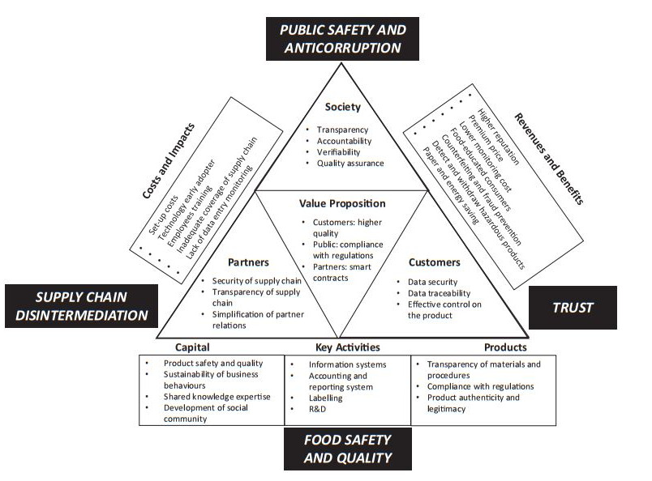

!!! info "Updated Date: Apr, 2024"

!!! Frankfurt-School_Ecota_ReFi_2023-2024

    === "Member of ReFi 2023-2024"

        * [Regeneraive Finance ReFi 18 Weeks](https://armanriazi.github.io/refi)

---

!!! Certificates_and_Seen_Toturials_2023

    === "Decentralized Finance Certificates 2023"

        * [Cryptocurrency-certificates](Learning/trade-crypto-certificate.md)

    === "Decentralized Finance 2023"

        * [Defi Tests](defi-tests.md)

---

!!! Experience_and_Seen_Toturials_2020-2021

    === "Cryptocurrency Trading"

        * [Trading-Technical-Fundamental-Sheets](trade.md)

    === "Passed Self-Study Tutorials"

        * [Cryptocurrency-tutorials](learning/crypto-trade-non-certificate.md)

---

