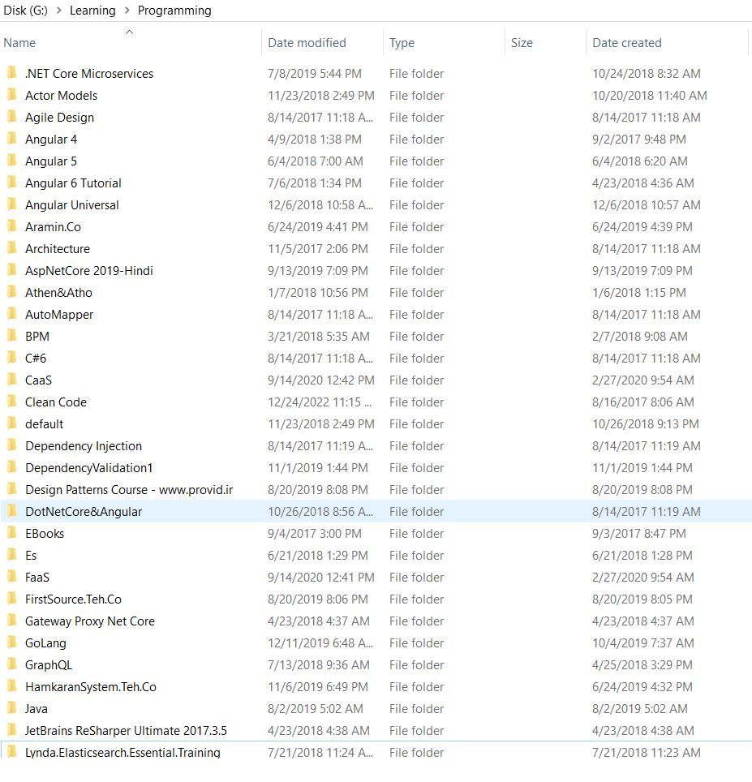
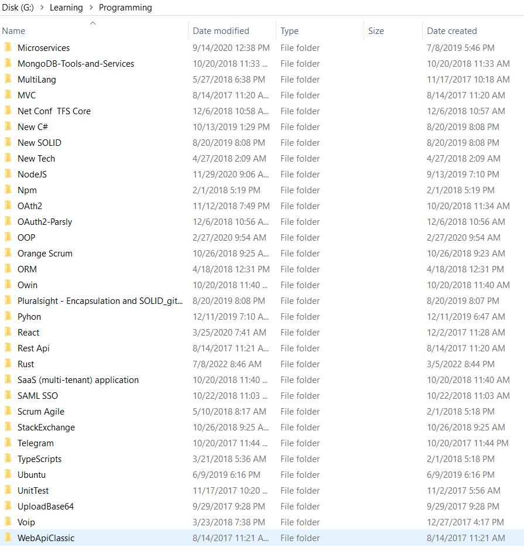

# Video Toturials Self-Study

!!! Learnt Toturials

    === "Rust Books Epub On Desktop 2023"
        > I prefer to find important chapters that related to my work specially blockchain. I gathered significant info on my desktop(offline documentation)
        * Sendil Kumar Nellaiyapen - Practical WebAssembly_ Explore the fundamentals of WebAssembly programming using Rust-Packt Publishing (2022)
        * Rust-In-Action Tim McNamara
        * Mastering In Rust - Rahul Sharma
        * Rust Essentials - Second Edition - Ivo Balbaert
        * Rust Programming Cookbook - Claus Matzinger
        * Hands-On Data Structures and Algorithms with Rust - Claus Matzinger

    === "Video courses 2019-2022"

        * There are some integration on language and technologies, so it is a part of blockhchain toturials. [Blockchain-Toturials](../../blockchain/learning/blockchain-non-cert-toturials.md)

    === "Video courses 2010-2019"

        * Below list shows my external HD(archived)
        * After all of them I just think I dunno anymore
        * I still have way to go

---

#### Followed Youtube Channels

- Everything about Rust Programming
- I do not remember there are so many playlists

#### Resources

