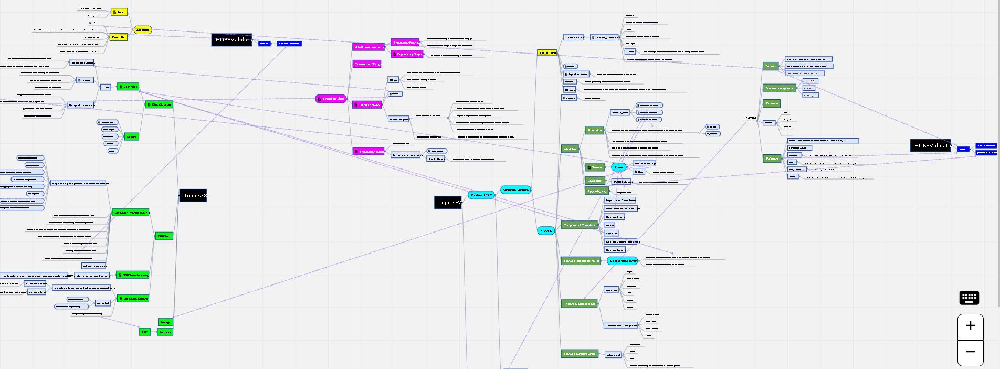

> Getting Luxary services that you can afford.

> You may be a co-founder or a developer, and you do not want to waste your time on fine/coarse-grained work. So, let another expert do it who had been spending time doing it for himself or the other clients. I have a roadmap for doing this kind of service. I am a counselor to help you.All of the following sections include a wage or fee.

---

!!! Developing_Programming

    === "Monorepo a Smart Building System"

        * [Monorepo for complex projects](public/programming/monorepo/monorepo.md)
    
    === "Nft Platform"

        What is the best solution to developing a Web 3.0 application. There are so many solutions in business. But which one has high quality and security, develops quickly, has low resources, and has no additional overhead. To keep you tuned, I am going to inter-reference this section. I have engaged on the project, and if I have enough time, you should be in contact with me to explain more about the proposed architecture.

---

!!! Research_Learning

    === "Mind Mapping of Substrate Framework"

        If you want to get updated-mind-mapping image, send me Email to armanriyazi.github.io@gmail.com 
        (Title: armanriyazi.github.io_Substrate_MindMapping)
        
    
    === "Teaching Rust"

        How to learn quickly ? I have the pleasure of introducing a repository that has more than 400 samples and has collected more than six significant references. I made a customised online book that contains md-files, and you can search for any gathered concept.
        I was wondering if you wanted to contact me. To gain access online, books with codes have a value of $100.
        - [Rust-All-In-One-Private](https://github.com/armanriazi/rust-all-in-one)
        Running Decentralized Ledgers and Configure Full/Master Node. 